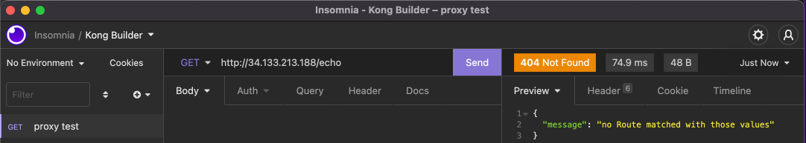
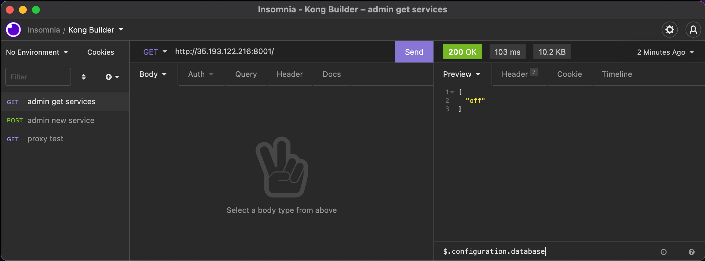

# kong-a-thon

Hacking on Kong

## Agenda

Let's deploy Kong and configure a service while documenting the experience.

Here are the discrete goals:

* Install Kong Enterprise free mode on Kubernetes using Helm
* Expose an API of your choice
* Secure API with Key Auth
* Apply a rate limit of 10 requests per minute

## Prerequisites

* [jq](https://stedolan.github.io/jq/) for JSON processing
* A running [Docker](https://www.docker.com/) if using a local K8s cluster
* [k3d](https://k3d.io/v5.3.0/) if using a local K8s cluster

## Usage

The repo uses a `Makefile` to automate steps and (warning) all K8s commands use the current context of `kubectl`. 

To create a GKE cluster:
```
GCP_PROJECT_ID=my-project GCP_CLUSTER_NAME=my-cluster make gke-cluster
```

To Deploy the echo service:
```
make echo
```

To deploy a shell for debugging (default namespace == `kong`):
```
NAMESPACE=default make shell
```

To attach to the shell in the `kong` namespace for debugging:
```
make attach-shell
```

To deploy Kong using helm with the values in `values.yaml`:
```
make kong
```

## Experience

The following are notes on my experience while building this in the style of a friction log. Where I felt some friction I designate with **Friction** and where I felt the product helped me I notated with **Harmony**.

* First order of business is install Kong. My first Google search: `kong install free with helm`.
	* Top hit is https://docs.konghq.com/gateway/2.7.x/install-and-run/helm/
	* **Friction**: Ideally I'd get the latest results always with something like `latest` in the URL path via search. Once I arrived I was directed to the latest version (which is still a static version `2.8.x` in the path) but it required an additional click.
	* **Harmony**: The prerequisites are clearly given and my system checks out.
	* **Friction**: I wish I could collapse the TOC on the docs while I'm viewing this particular page. I'm on a laptop screen and I need the real estate. 
	* **Friction**: My instructions are to install the "Free" version, and I've encountered instructions marked `Enterprise`, so I assume I should skip these steps, but it's not explicitly clear to me. Is OSS the Free version? Do I follow the Enterprise steps or no?
	* **Friction**: The docs have links that indicate to me they will open in a new tab (via the "flyaway icon"), but it navigated me away from the current page in the same tab.
	* **Friction**: The section _Create values.yaml file_ is vague and the referenced links are dense. For my getting started case, I'm wishing there was a more opinionated solution.  For example, something like: "For a basic OSS deployment, start with this file" that contains exactly what I need to get started with a basic deployment.  **Maybe** this document is for experienced users, and I need to be on a more "getting started" document than this one that I'm on?  I've landed on this directory https://github.com/Kong/charts/tree/main/charts/kong/example-values and I'm going to try [minimal-kong-controller.yaml](https://github.com/Kong/charts/blob/main/charts/kong/example-values/minimal-kong-controller.yaml), which is described as DB-less, but I don't know if that's a concern for me or not. Do I need a DB or no?
	* Executed `helm install kong/kong --generate-name --set ingressController.installCRDs=false`  **Friction**: I feel some disconnect in this document and this other one i've landed on (https://github.com/Kong/charts/blob/main/charts/kong/README.md)... I'm not sure if I need to install CRDs or not, I don't see an explanation and the TLDR doesn't match the other instructions I see.
	* **Friction**: I'm seeing errors related to ports and scheduling of the proxies. I don't see any information in the current docs about what my K8s cluster must look like to satisfy this or what ports the proxy uses but seems likely to be related to my k3d / docker local dev style k8s cluster I am using. 
	* **Friction**: I'm still struggling with the instructions to my task which ask me to install Kong Enterprise "Free Mode", but I can't figure out how/if that's different than Kong OSS. The instructions don't distinquish this well. Should I be following the Enterprise instructions, or the OSS ones? If the Enterprise, how do I enable Free mode specifically? The Enterprise instructions request I use a license file but where do I get this with Free mode?
	* **Friction**: I'm struggling with Helm so I'm just going to try K8s native instructions for comparison. I'm attempting to use the 2.8 instructions here https://docs.konghq.com/gateway/2.8.x/install-and-run/kubernetes/, but when I deploy via "Kubernetes Native" instructions, I'm getting 2.7 images which can be seen in this URL: https://bit.ly/kong-ingress-dbless that is referenced in the instructions 
	* I've shifted to GCP instead of a local K8s to try and move forward because of port conflict issues in my local dev K8s installation
	* **Friction**: I've found this blog post, https://konghq.com/blog/kong-gateway-enterprise-2-3-now-generally-available/, but i'm still in search of the step by step instructions for installing Free mode with Helm. This link tells me there are modes when following the installation steps including Free mode: https://docs.konghq.com/gateway/2.8.x/install-and-run/#installation-paths, but when I click through to Helm, the word "Free" isn't mentioned on the page at all. For Free mode, do I follow the Enterprise steps or do I skip them? If I follow them, how do I handle the license steps? I can't find a reference to Free mode in these helm values files: https://github.com/Kong/charts/tree/main/charts/kong/example-values. Searching helped me find this line https://github.com/Kong/charts/blob/e4c7f914a31c7090e59b254b7915dcd68860b468/charts/kong/values.yaml#L751 which tells me that omitting the license secret will result in Kong running in free mode, with some Enterprise features disabled.
		* Based on just digging, I've landed on a `values.yaml` file with this to enable Free mode. I still am not sure if this is correct or not
			```
			enterprise:
  		enabled: true
  		#license_secret: Left empty to try and enable Free mode
			```
	* **Harmony**: Once I shifted to GCP I seemed to have made progress and Kong seems to be running in a GKE cluster with the `values.yaml` file located in this repo.
	* **Friction**: The docs tell me to do this to verify the installation: `kubectl get svc my-kong-kong-admin -n kong --output=jsonpath='{.status.loadBalancer.ingress[0].ip}` to verify the installation, but I don't have this service.  How am I going to get the Admin API IP address without the `my-kong-kong-admin` service?

* Expose an API of your choice
	* **Harmony**: I used an OSS available docker image with a simple http service to work with and I now a service (the `echo` service) which just responds to http requests with some basic text.
		This can be enabled in the current K8s cluster with:
		```
		make echo
		```

		And I can test the service with 
		```
		make shell
		make attach-shell
		```

		```
		root@my-shell:/# curl -XGET http://echo.default
		'Kong FTW'
		```

	* Now I need to access my service it via the Kong ingress controller. Initial search term: `Kong expose service`, landing on https://docs.konghq.com/gateway/2.7.x/get-started/comprehensive/expose-services/, but i'm stepping back to this doc: https://docs.konghq.com/gateway/2.8.x/get-started/comprehensive/
	* **Friction**: The [doc](https://docs.konghq.com/gateway/2.8.x/get-started/comprehensive/#installation) warns me "During your installation, take note of the KONG_PASSWORD; you’ll need it later on in this guide for setting up user authorization", but this did not come up previously during installing. So i'm not sure if i'm going to be blocked on this step in the near future?
	* **Friction**: The doc is telling me to verify connectivity to Kong Gateway or the Kong Admin API, but I have no guidance on how to do this with my K8s cluster. I've tried various strategies to connect to either from within the cluster with no luck.  I see services running: kong-manager, kong-portal, kong-portalapi, kong-proxy. I can reach the proxy externally as it was assigned (as a Loadbalance) an external IP. but I'm not sure how to route request to either the kong manager or the Admin APi. From a pod internal to the cluster using `curl` I cannot succesfully connect to any service or pod open port regardless of the namespace. What is my "admin-hostname" ? I'm on GKE so I don't have direct access to the pods, what should I do here?
	* **Friction**: Related to the Admin API, the doc says "To find the URL, check the admin_listen property in the /etc/kong/kong.conf file.", but does not include guidance on how to find this file.
	* I've switched to some resources provided by our friend Vik Gamov to try and progress. Ideally I could do this entirely with the docs, but I haven't been able to get that done...
		* https://github.com/Kong/demo-scene/tree/main/kong-builders/02-15-2022
		* https://www.youtube.com/watch?v=lYm912ANi_E
	** Harmony**: With Viktor's help, I realized that the Admin service is not enabled by default. In retrospect, I maybe should have known it was going to be an independent K8s service (which wasn't running before), but also I didn't think to evaluate the defaults for Helm.  *Some clues in the docs would have helped me greatly here.*
	* I've swiched from `curl` to [Insomnia](https://insomnia.rest/) to work with the Admin API so learn about that product as well.
	* **Friction**: I have deployed Admin API as a Load Balancer and it was allocated an external IP.  When I try and `GET` against that (https://<external-ip>:8444 ), I get `Error: SSL peer certificate or SSH remote key was not OK`. So I think for the purposes of this exercise, I want to just disable `tls` and enable `http`. Thankfully, I now have a copy of the all the default helm values and I can see configurations for both of those. So I'm going to try `admin.http.enable=true` and `admin.https.enable=false`, of course, this would not be recommended for anything "real".
	* **Harmony**: For just a few moments I have success! After a delay the root route on the Admin API is now returning data, however...
	* **Friction**: I'm watching the pods and I see the `my-kong-....` pod in a crash->restart loop. I allowed the service to run and the service seems to have stablized. I put a copy of the logs in this repo, I'm thinking that the reason for the initial instability has to do with the type of K8s cluster I'm running, which is a GKE "autopilot" cluster meant to intelligently manage resources.
	* I've switched back to the docs to continue with the task, picking up here: https://docs.konghq.com/gateway/2.8.x/get-started/comprehensive/expose-services/
	* **Harmony**: First, let's validate that there we can't reach the route already via the proxy:
			
	* **Friction**: I want to use Insomnia to `POST` data to the admin API, and the docs give me this example: `curl -i -X POST http://<admin-host>:8001/services --data name=example_service --data url='http://mockbin.org'`, but I'm not sure how to construct that in Insomnia. Is the BODY type Text `Plain`, or maybe Structured `Multipart Form`? The `curl` manual might help me decide, but _examples in the docs using Insomnia_ would be great here.  I've tried various ways with Insomnia, but just getting timeouts, going to switch back to `curl` to make progress.
	* **Friction**: **OOOF** I need to circle back and figure out how to deploy a database now... No warning on this is jarring, as adding a service seems fundamental.
		```
		curl -i -XPOST http://<admin-host>/services --data name=echo --data url='http://echo.default'
		HTTP/1.1 405 Not Allowed
		Date: Tue, 22 Mar 2022 14:03:22 GMT
		Content-Type: application/json; charset=utf-8
		Connection: keep-alive
		Access-Control-Allow-Origin: *
		Content-Length: 114
		X-Kong-Admin-Latency: 0
		Server: kong/2.8.0
		
		{"name":"operation unsupported","code":12,"message":"cannot create 'services' entities when not using a database"}%
		``` 
	* **Friction**: The helm installation docs don't provide any details on deploying with a DB, so I've landed on the charts repo here: https://github.com/Kong/charts/blob/main/charts/kong/README.md#database. This guides me with "For more details, please read the env section", but going there doesn't give me good step-by-step guidance.  Back in the main README, I see this comment, "The chart can optionally spawn a Postgres instance using Bitnami's Postgres chart as a sub-chart. Set postgresql.enabled=true to enable the sub-chart. Enabling this will auto-populate Postgres connection settings in Kong's environment.". I also removed the `env.database: "off"` setting.  Is this going to do _all_ the magic for me? We shall see...
	* **Friction**: The doc tells me that enabling `postgres.enabled=true` will "auto-populate Postrgress connection settings", but I was hoping it would do _all_ the configuration for me, but that doesn't seem to be the cast. When I look at what's deployed, I still see this: `env.database="off"`.  Adding this in `env.database: postgres`.  After an update, I still see this from Admin Service, hmmmm....
		
		but when I run : `helm -n kong get all my-kong`, I see:
		```
		env:
			database: postgres
		```
	* **Friction**: As a sanity check, I've tried restarting everything from the beginning, and now i'm seeing this error in the kong migrations, so the database is failing to initialize and kong itself cannot start, so I'm back to square 1.
		```
		 Error: [PostgreSQL error] failed to retrieve PostgreSQL server_version_num: FATAL: password authentication failed for user "kong"  
		```

* Secure API with Key Auth
	* TODO

* Apply a rate limit of 10 requests per minute
	* TODO

